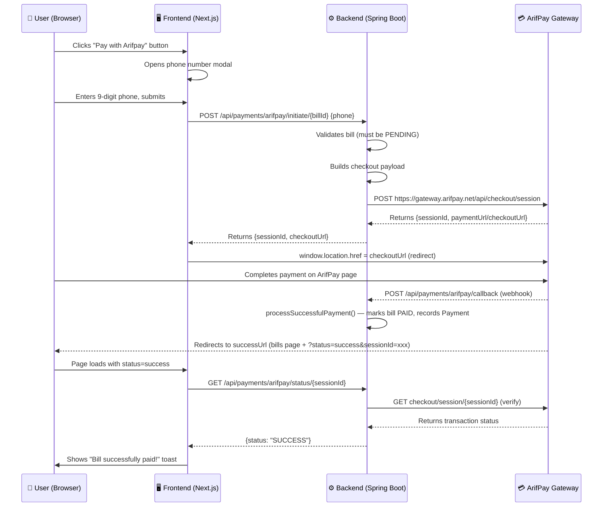

# ArifPay Payment Integration — Complete Implementation Guide

> [!NOTE]
> This documentation is extracted from the **MardaArif** project (MardaArifFront + MardaArifBack).
> It covers the **full end-to-end flow** from the frontend "Pay with Arifpay" button to the backend checkout session creation, webhook handling, and payment recording.

---

## Table of Contents

1. [Architecture Overview](#architecture-overview)
2. [Payment Flow Diagram](#payment-flow-diagram)
3. [Database Schema](#database-schema)
4. [Backend Implementation (Spring Boot / Java)](#backend-implementation-spring-boot--java)
5. [Frontend Implementation (Next.js / React)](#frontend-implementation-nextjs--react)
6. [Configuration & Environment Setup](#configuration--environment-setup)
7. [Security Considerations](#security-considerations)
8. [Testing with Mock Mode](#testing-with-mock-mode)

---

## Architecture Overview

| Layer        | Technology            | Port  |
|--------------|-----------------------|-------|
| Frontend     | Next.js (React)       | 3001  |
| Backend      | Spring Boot 3.2 (Java 17) | 8083  |
| Database     | MySQL                 | 3307  |
| Payment Gateway | ArifPay Checkout API | External |

The frontend calls the backend API via a Next.js proxy rewrite (`/backend/*` → `http://localhost:8083/*`). The backend talks to ArifPay's Checkout Session API, and ArifPay calls back the backend's webhook when a payment completes.

---

## Payment Flow Diagram



---

## Database Schema

### 1. `arifpay_config` table (stores ArifPay credentials & URLs)

```sql
CREATE TABLE arifpay_config (
    id            INT AUTO_INCREMENT PRIMARY KEY,
    api_key       VARCHAR(500)  NOT NULL,
    merchant_id   VARCHAR(500)  NOT NULL,
    api_url       VARCHAR(500)  NOT NULL,   -- e.g. https://gateway.arifpay.net/api/checkout/session
    success_url   VARCHAR(500)  NOT NULL,   -- e.g. http://yourdomain.com/bills?status=success
    cancel_url    VARCHAR(500)  NOT NULL,   -- e.g. http://yourdomain.com/bills?status=cancel
    error_url     VARCHAR(500)  NOT NULL,   -- e.g. http://yourdomain.com/bills?status=error
    beneficiary_bank    VARCHAR(100) NOT NULL, -- Bank code, e.g. AWINETAA
    beneficiary_account VARCHAR(100) NOT NULL, -- Account number
    updated_at    DATETIME
);
```

### 2. `bills` table (relevant columns for payment)

```sql
CREATE TABLE bills (
    id                           BIGINT AUTO_INCREMENT PRIMARY KEY,
    bill_id                      VARCHAR(100) NOT NULL,
    city_id                      INT NOT NULL,
    customer_id                  VARCHAR(100),
    customer_name                VARCHAR(300),
    phone_number                 VARCHAR(20),
    email                        VARCHAR(100),
    amount_due                   DOUBLE,
    description                  VARCHAR(500),
    status                       VARCHAR(20) NOT NULL DEFAULT 'PENDING',  -- PENDING, PAID, CANCELLED, EXPIRED
    paid_amount                  DOUBLE,
    paid_on                      VARCHAR(30),
    bank_name                    VARCHAR(200),
    bank_transaction_reference   VARCHAR(200),
    created_at                   DATETIME NOT NULL,
    updated_at                   DATETIME
);
```

### 3. `payments` table (payment records)

```sql
CREATE TABLE payments (
    id                           BIGINT AUTO_INCREMENT PRIMARY KEY,
    bill_id                      BIGINT NOT NULL,
    city_id                      INT NOT NULL,
    customer_id                  VARCHAR(100),
    customer_name                VARCHAR(300),
    bill_number                  VARCHAR(100),
    paid_amount                  DOUBLE,
    paid_on                      VARCHAR(30),
    bank_name                    VARCHAR(200),
    bank_transaction_reference   VARCHAR(200),
    payment_method               VARCHAR(30),   -- BANK, MOBILE, CASH
    is_reconciled                BOOLEAN NOT NULL DEFAULT FALSE,
    reconciled_at                DATETIME,
    created_at                   DATETIME NOT NULL
);
```

> [!TIP]
> With `spring.jpa.hibernate.ddl-auto=update` in application.properties, these tables are auto-created from the JPA entities. The SQL above is for reference only.

---

## Backend Implementation (Spring Boot / Java)

### File Structure (ArifPay-specific files)

```
src/main/java/com/mardaarif/
├── model/
│   ├── ArifPayConfig.java       ← JPA entity for config
│   ├── Bill.java                ← Bill entity
│   ├── BillStatus.java          ← Enum: PENDING, PAID, CANCELLED, EXPIRED
│   └── Payment.java             ← Payment record entity
├── repository/
│   └── ArifPayConfigRepository.java
├── service/
│   ├── ArifPayConfigService.java        ← Get/save config
│   ├── ArifPayConfigInitializer.java    ← Seeds default config on first run
│   ├── BillService.java
│   └── PaymentService.java             ← Records payments, updates bill status
├── controller/
│   ├── ArifpayController.java           ← Main ArifPay endpoints (initiate, callback, status)
│   └── ArifPayConfigController.java     ← CRUD for config (admin UI)
└── security/
    └── WebSecurityConfig.java           ← Permits /callback publicly for webhooks
```

---

### Step 1: ArifPayConfig Entity

> [!IMPORTANT]
> This entity stores your ArifPay API key, merchant ID, gateway URL, redirect URLs, and beneficiary bank details. There is only **one row** in this table.

```java
package com.yourpackage.model;

import jakarta.persistence.*;
import java.time.LocalDateTime;

@Entity
@Table(name = "arifpay_config")
public class ArifPayConfig {

    @Id
    @GeneratedValue(strategy = GenerationType.IDENTITY)
    private Integer id;

    @Column(name = "api_key", nullable = false, length = 500)
    private String apiKey;

    @Column(name = "merchant_id", nullable = false, length = 500)
    private String merchantId;

    @Column(name = "api_url", nullable = false, length = 500)
    private String apiUrl;

    @Column(name = "success_url", nullable = false, length = 500)
    private String successUrl;

    @Column(name = "cancel_url", nullable = false, length = 500)
    private String cancelUrl;

    @Column(name = "error_url", nullable = false, length = 500)
    private String errorUrl;

    @Column(name = "beneficiary_bank", nullable = false, length = 100)
    private String beneficiaryBank;

    @Column(name = "beneficiary_account", nullable = false, length = 100)
    private String beneficiaryAccount;

    @Column(name = "updated_at")
    private LocalDateTime updatedAt;

    public ArifPayConfig() {}

    @PrePersist
    protected void onCreate() { this.updatedAt = LocalDateTime.now(); }

    @PreUpdate
    protected void onUpdate() { this.updatedAt = LocalDateTime.now(); }

    // Getters and Setters (all fields)
    public Integer getId() { return id; }
    public void setId(Integer id) { this.id = id; }
    public String getApiKey() { return apiKey; }
    public void setApiKey(String apiKey) { this.apiKey = apiKey; }
    public String getMerchantId() { return merchantId; }
    public void setMerchantId(String merchantId) { this.merchantId = merchantId; }
    public String getApiUrl() { return apiUrl; }
    public void setApiUrl(String apiUrl) { this.apiUrl = apiUrl; }
    public String getSuccessUrl() { return successUrl; }
    public void setSuccessUrl(String successUrl) { this.successUrl = successUrl; }
    public String getCancelUrl() { return cancelUrl; }
    public void setCancelUrl(String cancelUrl) { this.cancelUrl = cancelUrl; }
    public String getErrorUrl() { return errorUrl; }
    public void setErrorUrl(String errorUrl) { this.errorUrl = errorUrl; }
    public String getBeneficiaryBank() { return beneficiaryBank; }
    public void setBeneficiaryBank(String beneficiaryBank) { this.beneficiaryBank = beneficiaryBank; }
    public String getBeneficiaryAccount() { return beneficiaryAccount; }
    public void setBeneficiaryAccount(String beneficiaryAccount) { this.beneficiaryAccount = beneficiaryAccount; }
    public LocalDateTime getUpdatedAt() { return updatedAt; }
    public void setUpdatedAt(LocalDateTime updatedAt) { this.updatedAt = updatedAt; }
}
```

---

### Step 2: Repository

```java
package com.yourpackage.repository;

import com.yourpackage.model.ArifPayConfig;
import org.springframework.data.jpa.repository.JpaRepository;
import org.springframework.stereotype.Repository;

@Repository
public interface ArifPayConfigRepository extends JpaRepository<ArifPayConfig, Integer> {
}
```

---

### Step 3: Config Service (get/save the single config row)

```java
package com.yourpackage.service;

import com.yourpackage.model.ArifPayConfig;
import com.yourpackage.repository.ArifPayConfigRepository;
import org.springframework.beans.factory.annotation.Autowired;
import org.springframework.stereotype.Service;

@Service
public class ArifPayConfigService {

    @Autowired
    private ArifPayConfigRepository configRepository;

    /** Returns the single ArifPay configuration row. */
    public ArifPayConfig getConfig() {
        return configRepository.findAll()
                .stream()
                .findFirst()
                .orElseThrow(() -> new RuntimeException(
                    "ArifPay configuration not found. Please set up the configuration first."));
    }

    /** Creates or updates the ArifPay configuration (upsert). */
    public ArifPayConfig saveConfig(ArifPayConfig configData) {
        ArifPayConfig existing = configRepository.findAll()
                .stream().findFirst().orElse(null);

        if (existing != null) {
            existing.setApiKey(configData.getApiKey());
            existing.setMerchantId(configData.getMerchantId());
            existing.setApiUrl(configData.getApiUrl());
            existing.setSuccessUrl(configData.getSuccessUrl());
            existing.setCancelUrl(configData.getCancelUrl());
            existing.setErrorUrl(configData.getErrorUrl());
            existing.setBeneficiaryBank(configData.getBeneficiaryBank());
            existing.setBeneficiaryAccount(configData.getBeneficiaryAccount());
            return configRepository.save(existing);
        } else {
            return configRepository.save(configData);
        }
    }
}
```

---

### Step 4: Config Initializer (seeds default values on first startup)

```java
package com.yourpackage.service;

import com.yourpackage.model.ArifPayConfig;
import com.yourpackage.repository.ArifPayConfigRepository;
import org.slf4j.Logger;
import org.slf4j.LoggerFactory;
import org.springframework.beans.factory.annotation.Autowired;
import org.springframework.boot.CommandLineRunner;
import org.springframework.stereotype.Component;

@Component
public class ArifPayConfigInitializer implements CommandLineRunner {

    private static final Logger logger = LoggerFactory.getLogger(ArifPayConfigInitializer.class);

    @Autowired
    private ArifPayConfigRepository configRepository;

    @Override
    public void run(String... args) {
        if (configRepository.count() == 0) {
            ArifPayConfig config = new ArifPayConfig();
            config.setApiKey("YOUR_ARIFPAY_API_KEY");           // Get from ArifPay dashboard
            config.setMerchantId("YOUR_MERCHANT_ID");            // e.g. APMG:001084
            config.setApiUrl("https://gateway.arifpay.net/api/checkout/session");
            config.setSuccessUrl("http://YOUR_FRONTEND_URL/bills?status=success");
            config.setCancelUrl("http://YOUR_FRONTEND_URL/bills?status=cancel");
            config.setErrorUrl("http://YOUR_FRONTEND_URL/bills?status=error");
            config.setBeneficiaryBank("AWINETAA");               // Your bank code
            config.setBeneficiaryAccount("1000123456789");        // Your account number
            configRepository.save(config);
            logger.info("[ArifPayConfigInitializer] Default ArifPay configuration seeded.");
        }
    }
}
```

---

### Step 5: ArifpayController — The Core Backend (3 endpoints)

> [!IMPORTANT]
> This is the main controller. It has **3 endpoints**:
> 1. `POST /api/payments/arifpay/initiate/{billId}` — Creates an ArifPay checkout session
> 2. `POST /api/payments/arifpay/callback` — Webhook called by ArifPay after payment
> 3. `GET /api/payments/arifpay/status/{sessionId}` — Frontend verifies payment status after redirect

```java
package com.yourpackage.controller;

import com.yourpackage.model.ArifPayConfig;
import com.yourpackage.model.Bill;
import com.yourpackage.model.BillStatus;
import com.yourpackage.model.Payment;
import com.yourpackage.service.ArifPayConfigService;
import com.yourpackage.service.BillService;
import com.yourpackage.service.PaymentService;
import org.slf4j.Logger;
import org.slf4j.LoggerFactory;
import org.springframework.beans.factory.annotation.Autowired;
import org.springframework.http.*;
import org.springframework.web.bind.annotation.*;
import org.springframework.web.client.RestTemplate;

import java.time.LocalDateTime;
import java.util.*;

@RestController
@RequestMapping("/api/payments/arifpay")
public class ArifpayController {

    private static final Logger logger = LoggerFactory.getLogger(ArifpayController.class);

    @Autowired private BillService billService;
    @Autowired private PaymentService paymentService;
    @Autowired private ArifPayConfigService configService;

    private final RestTemplate restTemplate = new RestTemplate();

    // =====================================================================
    // ENDPOINT 1: Initiate ArifPay Checkout Session
    // =====================================================================
    @PostMapping("/initiate/{billId}")
    public ResponseEntity<?> initiatePayment(
            @PathVariable Long billId,
            @RequestBody(required = false) Map<String, String> body) {

        ArifPayConfig config = configService.getConfig();

        // 1. Validate the bill exists and is PENDING
        Optional<Bill> billOpt = billService.getBillById(billId);
        if (billOpt.isEmpty()) {
            return ResponseEntity.status(HttpStatus.NOT_FOUND)
                    .body(Map.of("message", "Bill not found with ID: " + billId));
        }
        Bill bill = billOpt.get();
        if (bill.getStatus() != BillStatus.PENDING) {
            return ResponseEntity.status(HttpStatus.BAD_REQUEST)
                    .body(Map.of("message", "Bill is already paid or cancelled"));
        }

        // 2. Generate unique nonce (reference ID): billId_timestamp
        String nonce = bill.getId().toString() + "_" + System.currentTimeMillis();

        // 3. Build the ArifPay checkout session payload
        Map<String, Object> payload = new LinkedHashMap<>();
        payload.put("cancelUrl", config.getCancelUrl());
        payload.put("successUrl", config.getSuccessUrl());
        payload.put("errorUrl", config.getErrorUrl());
        payload.put("notifyUrl", getWebhookUrl());  // Your publicly accessible webhook URL

        // Phone number: use from request body, fallback to bill's phone
        String rawPhone = (body != null && body.get("phone") != null)
                ? body.get("phone") : bill.getPhoneNumber();
        payload.put("phone", normalizePhone(rawPhone));
        payload.put("email", bill.getEmail() != null && !bill.getEmail().isEmpty()
                ? bill.getEmail() : "customer@example.com");
        payload.put("nonce", nonce);

        // Payment methods to offer
        payload.put("paymentMethods", Arrays.asList("TELEBIRR_USSD", "CBE", "AWASH_BIRR"));

        // Expiration: 24 hours from now
        payload.put("expireDate", LocalDateTime.now().plusDays(1).toString());

        // Item details
        Map<String, Object> item = new LinkedHashMap<>();
        String itemName = bill.getDescription() != null && !bill.getDescription().isEmpty()
                ? bill.getDescription() : "Water Bill Payment";
        item.put("name", itemName);
        item.put("price", bill.getAmountDue());
        item.put("quantity", 1);
        item.put("description", itemName);
        payload.put("items", Collections.singletonList(item));

        // Beneficiary (where the money goes)
        Map<String, Object> beneficiary = new LinkedHashMap<>();
        beneficiary.put("accountNumber", config.getBeneficiaryAccount());
        beneficiary.put("bank", config.getBeneficiaryBank());
        beneficiary.put("amount", bill.getAmountDue());
        payload.put("beneficiaries", Collections.singletonList(beneficiary));

        payload.put("lang", "EN");

        // 4. Call ArifPay API
        try {
            HttpHeaders headers = new HttpHeaders();
            headers.setContentType(MediaType.APPLICATION_JSON);
            headers.set("x-arifpay-key", config.getApiKey());  // ← API key goes in this header

            HttpEntity<Map<String, Object>> entity = new HttpEntity<>(payload, headers);
            logger.info("[ArifpayController] Creating Session. Bill ID={}, Amount={}", billId, bill.getAmountDue());

            ResponseEntity<Map> response = restTemplate.postForEntity(
                    config.getApiUrl(), entity, Map.class);

            if (response.getStatusCode().is2xxSuccessful() && response.getBody() != null) {
                Map<String, Object> responseBody = response.getBody();

                // ArifPay may nest data inside a "data" field
                Map<String, Object> data = responseBody;
                if (responseBody.containsKey("data") && responseBody.get("data") instanceof Map) {
                    data = (Map<String, Object>) responseBody.get("data");
                }

                // Extract sessionId (try multiple possible field names)
                String sid = getStringField(data, "sessionId", "session_id", "id");

                // Extract checkout URL (try multiple possible field names)
                String checkoutUrl = getStringField(data,
                        "paymentUrl", "payment_url", "checkoutUrl", "checkout_url", "url");

                // Build normalized response for frontend
                Map<String, Object> result = new LinkedHashMap<>(responseBody);
                if (sid != null) result.put("sessionId", sid);
                if (checkoutUrl != null) result.put("checkoutUrl", checkoutUrl);
                return ResponseEntity.ok(result);
            } else {
                return ResponseEntity.status(HttpStatus.INTERNAL_SERVER_ERROR)
                        .body(Map.of("message", "Arifpay returned code: " + response.getStatusCodeValue()));
            }
        } catch (Exception e) {
            logger.error("[ArifpayController] Error initiating payment", e);
            return ResponseEntity.status(HttpStatus.INTERNAL_SERVER_ERROR)
                    .body(Map.of("message", "Exception creating checkout session: " + e.getMessage()));
        }
    }

    // =====================================================================
    // ENDPOINT 2: Webhook Callback (called by ArifPay server-to-server)
    // =====================================================================
    @PostMapping("/callback")
    public ResponseEntity<?> handleCallback(@RequestBody Map<String, Object> payload) {
        logger.info("[ArifpayController] Webhook received: {}", payload);
        try {
            Map<String, Object> data = (Map<String, Object>) payload.get("data");
            if (data == null) data = payload;

            // ArifPay sends "transactionStatus" (not just "status")
            String status = getStringField(data, "transactionStatus", "status");

            // Transaction ID may be nested inside "transaction" object
            String transactionId = getStringField(data, "transactionId");
            if (transactionId == null && data.get("transaction") instanceof Map) {
                Map<String, Object> txn = (Map<String, Object>) data.get("transaction");
                transactionId = getStringField(txn, "transactionId");
            }

            // ArifPay sends "nonce" as the reference (our billId_timestamp)
            String referenceId = getStringField(data, "nonce", "referenceId");

            if ("SUCCESS".equalsIgnoreCase(status) || "PAID".equalsIgnoreCase(status)
                    || "COMPLETED".equalsIgnoreCase(status)) {
                processSuccessfulPayment(referenceId, transactionId, data);
                return ResponseEntity.ok(Map.of("status", "SUCCESS"));
            } else {
                logger.info("[ArifpayController] Webhook status: {} (ignored)", status);
                return ResponseEntity.ok(Map.of("status", "IGNORED"));
            }
        } catch (Exception e) {
            logger.error("[ArifpayController] Webhook processing failed", e);
            return ResponseEntity.status(HttpStatus.INTERNAL_SERVER_ERROR)
                    .body(Map.of("error", e.getMessage()));
        }
    }

    // =====================================================================
    // ENDPOINT 3: Check Payment Status (called by frontend after redirect)
    // =====================================================================
    @GetMapping("/status/{sessionId}")
    public ResponseEntity<?> getPaymentStatus(@PathVariable String sessionId) {
        logger.info("[ArifpayController] Checking status for session: {}", sessionId);
        try {
            ArifPayConfig config = configService.getConfig();
            HttpHeaders headers = new HttpHeaders();
            headers.set("x-arifpay-key", config.getApiKey());
            HttpEntity<Void> entity = new HttpEntity<>(headers);

            // Query ArifPay: GET {apiUrl}/{sessionId}
            String queryUrl = config.getApiUrl() + "/" + sessionId;
            ResponseEntity<Map> response = restTemplate.exchange(
                    queryUrl, HttpMethod.GET, entity, Map.class);

            if (response.getStatusCode().is2xxSuccessful() && response.getBody() != null) {
                Map<String, Object> sessionData = response.getBody();
                String paymentStatus = getStringField(sessionData,
                        "transactionStatus", "paymentStatus", "status");

                String referenceId = getStringField(sessionData, "nonce", "referenceId");
                String transactionId = getStringField(sessionData, "transactionId");
                if (transactionId == null && sessionData.get("transaction") instanceof Map) {
                    transactionId = getStringField(
                            (Map<String, Object>) sessionData.get("transaction"), "transactionId");
                }

                if ("SUCCESS".equalsIgnoreCase(paymentStatus) || "PAID".equalsIgnoreCase(paymentStatus)
                        || "COMPLETED".equalsIgnoreCase(paymentStatus)) {
                    processSuccessfulPayment(referenceId, transactionId, sessionData);
                    return ResponseEntity.ok(Map.of("status", "SUCCESS", "details", sessionData));
                } else {
                    return ResponseEntity.ok(Map.of(
                            "status", paymentStatus != null ? paymentStatus : "PENDING",
                            "details", sessionData));
                }
            } else {
                return ResponseEntity.status(response.getStatusCode())
                        .body(Map.of("message", "Arifpay query response: " + response.getStatusCodeValue()));
            }
        } catch (Exception e) {
            logger.error("[ArifpayController] Error querying status", e);
            return ResponseEntity.status(HttpStatus.INTERNAL_SERVER_ERROR)
                    .body(Map.of("message", "Exception checking status: " + e.getMessage()));
        }
    }

    // =====================================================================
    // Helper: Process a successful payment (shared by callback & status check)
    // =====================================================================
    private void processSuccessfulPayment(String referenceId, String transactionId,
                                           Map<String, Object> data) {
        if (referenceId == null) {
            logger.error("[ArifpayController] Cannot record payment: referenceId is null");
            return;
        }

        // nonce format: "billId_timestamp" — extract the bill ID
        String[] parts = referenceId.split("_");
        Long billId = Long.parseLong(parts[0]);

        Optional<Bill> billOpt = billService.getBillById(billId);
        if (billOpt.isPresent()) {
            Bill bill = billOpt.get();
            if (bill.getStatus() == BillStatus.PENDING) {
                Double amountPaid = bill.getAmountDue();
                if (data.containsKey("amount")) {
                    try {
                        amountPaid = ((Number) data.get("amount")).doubleValue();
                    } catch (Exception ignored) {}
                }

                String paidOn = LocalDateTime.now().toString().split("T")[0];
                paymentService.recordPayment(
                        bill.getId(),
                        amountPaid,
                        paidOn,
                        "Arifpay",
                        transactionId != null ? transactionId : ("ARIFPAY-" + System.currentTimeMillis()),
                        "MOBILE");  // paymentMethod = MOBILE for ArifPay
            }
        }
    }

    /** Normalize phone to 251XXXXXXXXX format */
    private String normalizePhone(String phone) {
        if (phone == null || phone.isEmpty()) return "251900000000";
        phone = phone.trim().replaceAll("[\\s\\-]", "");
        if (phone.startsWith("+")) phone = phone.substring(1);
        if (phone.startsWith("0")) phone = "251" + phone.substring(1);
        if (!phone.startsWith("251")) phone = "251" + phone;
        return phone;
    }

    /** Your publicly-accessible webhook URL */
    private String getWebhookUrl() {
        // IMPORTANT: Replace with your actual public server URL in production
        return "http://YOUR_SERVER_IP:8083/api/payments/arifpay/callback";
    }

    /** Try multiple possible field names, return first non-null */
    private String getStringField(Map<String, Object> map, String... keys) {
        for (String key : keys) {
            Object val = map.get(key);
            if (val != null) return val.toString();
        }
        return null;
    }
}
```

---

### Step 6: PaymentService — Recording Payments

```java
package com.yourpackage.service;

import com.yourpackage.model.Bill;
import com.yourpackage.model.BillStatus;
import com.yourpackage.model.Payment;
import com.yourpackage.repository.BillRepository;
import com.yourpackage.repository.PaymentRepository;
import org.slf4j.Logger;
import org.slf4j.LoggerFactory;
import org.springframework.beans.factory.annotation.Autowired;
import org.springframework.stereotype.Service;

@Service
public class PaymentService {
    private static final Logger logger = LoggerFactory.getLogger(PaymentService.class);

    @Autowired private PaymentRepository paymentRepository;
    @Autowired private BillRepository billRepository;

    /**
     * Record a payment for a bill:
     *   1. Update bill status to PAID
     *   2. Create a Payment record
     */
    public Payment recordPayment(Long billId, Double paidAmount, String paidOn,
                                  String bankName, String bankRef, String paymentMethod) {
        Bill bill = billRepository.findById(billId)
            .orElseThrow(() -> new RuntimeException("Bill not found: " + billId));

        // Update the bill
        bill.setStatus(BillStatus.PAID);
        bill.setPaidAmount(paidAmount);
        bill.setPaidOn(paidOn);
        bill.setBankName(bankName);
        bill.setBankTransactionReference(bankRef);
        billRepository.save(bill);

        // Create payment record
        Payment payment = new Payment();
        payment.setBillId(billId);
        payment.setCityId(bill.getCityId());
        payment.setCustomerId(bill.getCustomerId());
        payment.setCustomerName(bill.getCustomerName());
        payment.setBillNumber(bill.getBillId());
        payment.setPaidAmount(paidAmount);
        payment.setPaidOn(paidOn);
        payment.setBankName(bankName);
        payment.setBankTransactionReference(bankRef);
        payment.setPaymentMethod(paymentMethod != null ? paymentMethod : "BANK");

        logger.info("[PaymentService] Recording payment for billId={}, amount={}", billId, paidAmount);
        return paymentRepository.save(payment);
    }
}
```

---

### Step 7: Security Config — Allow Webhook Endpoint Publicly

> [!WARNING]
> The ArifPay webhook callback must be accessible without authentication. Add it to your security config's `permitAll()` list.

```java
// In your WebSecurityConfig.java — inside filterChain()
.authorizeHttpRequests(auth -> auth
    // ... your other rules ...

    // PUBLIC: ArifPay webhook callback (ArifPay server calls this)
    .requestMatchers("/api/payments/arifpay/callback").permitAll()

    // All other requests require authentication
    .anyRequest().authenticated()
)
```

---

### Maven Dependencies Required

No extra dependencies beyond standard Spring Boot starters. The `RestTemplate` used for calling ArifPay API is included in `spring-boot-starter-web`.

```xml
<dependency>
    <groupId>org.springframework.boot</groupId>
    <artifactId>spring-boot-starter-web</artifactId>
</dependency>
<dependency>
    <groupId>org.springframework.boot</groupId>
    <artifactId>spring-boot-starter-data-jpa</artifactId>
</dependency>
```

---

## Frontend Implementation (Next.js / React)

### File Structure (ArifPay-specific)

```
app/
├── lib/
│   └── apiService.js                  ← API functions (initiateArifpayPayment, checkArifpayStatus)
├── (dashboard)/
│   └── bills/
│       └── page.js                    ← Bill listing page with "Pay with Arifpay" button
next.config.mjs                        ← Proxy rewrite to backend
```

---

### Step 1: Next.js Proxy Configuration

> [!IMPORTANT]
> The frontend uses Next.js rewrites to proxy API calls to the backend. This avoids CORS issues during development and production.

```js
// next.config.mjs
/** @type {import('next').NextConfig} */
const nextConfig = {
  async rewrites() {
    const backendUrl = process.env.BACKEND_URL || 'http://localhost:8083';
    return [
      {
        source: "/backend/:path*",
        destination: `${backendUrl}/:path*`,
      },
    ];
  },
};
export default nextConfig;
```

All frontend API calls go to `/backend/api/...` which Next.js rewrites to `http://localhost:8083/api/...`.

---

### Step 2: API Service Functions

```js
// app/lib/apiService.js

const API_BASE = typeof window !== 'undefined'
    ? '/backend'
    : (process.env.BACKEND_URL || 'http://localhost:8083');

function getAuthHeaders() {
    const token = typeof window !== 'undefined' ? localStorage.getItem('auth_token') : null;
    const headers = { 'Content-Type': 'application/json' };
    if (token) {
        headers['Authorization'] = `Bearer ${token}`;
    }
    return headers;
}

async function handleResponse(res) {
    if (res.status === 401) {
        // Token expired — redirect to login
        if (typeof window !== 'undefined') {
            localStorage.removeItem('auth_token');
            window.location.href = '/signin';
        }
        throw new Error('Unauthorized');
    }
    const data = await res.json().catch(() => null);
    if (!res.ok) {
        throw new Error(data?.message || data?.error || `Request failed (${res.status})`);
    }
    return data;
}

// ============ ARIFPAY PAYMENTS ============

/**
 * Initiate an ArifPay checkout session for a specific bill.
 * @param {number} billId - The internal bill ID (primary key)
 * @param {string} phone  - Full phone number (e.g. "251911223344")
 * @returns {Promise<{sessionId: string, checkoutUrl: string}>}
 */
export async function initiateArifpayPayment(billId, phone) {
    const res = await fetch(`${API_BASE}/api/payments/arifpay/initiate/${billId}`, {
        method: 'POST',
        headers: getAuthHeaders(),
        body: JSON.stringify({ phone: phone || undefined }),
    });
    return handleResponse(res);
}

/**
 * Check the payment status of an ArifPay session.
 * Called after user is redirected back from ArifPay.
 * @param {string} sessionId - The ArifPay session ID
 * @returns {Promise<{status: string}>}
 */
export async function checkArifpayStatus(sessionId) {
    const res = await fetch(`${API_BASE}/api/payments/arifpay/status/${sessionId}`, {
        headers: getAuthHeaders(),
    });
    return handleResponse(res);
}
```

---

### Step 3: Bills Page Component — "Pay with Arifpay" Button & Modal

Below is a **simplified, focused version** of the bills page showing only the ArifPay-related parts:

```jsx
"use client";
import { useEffect, useState } from "react";
import { initiateArifpayPayment, checkArifpayStatus } from "../../lib/apiService";

export default function BillsPage() {
  const [bills, setBills] = useState([]);
  const [toast, setToast] = useState(null);

  // ---- Arifpay Modal State ----
  const [isModalOpen, setIsModalOpen] = useState(false);
  const [modalBill, setModalBill] = useState(null);
  const [phoneDigits, setPhoneDigits] = useState("");
  const [submittingPayment, setSubmittingPayment] = useState(false);

  // ============================================================
  // STEP A: On page load, check if we're returning from ArifPay
  // ============================================================
  useEffect(() => {
    const params = new URLSearchParams(window.location.search);
    const status = params.get("status");
    const sessionId = params.get("sessionId");

    if (status) {
      // Clean the URL so status check doesn't repeat on reload
      window.history.replaceState({}, document.title, window.location.pathname);

      if (status === "success" && sessionId) {
        showToast("Verifying payment status...", "info");
        checkArifpayStatus(sessionId)
          .then((res) => {
            if (res.status === "SUCCESS") {
              showToast("Bill successfully paid with ArifPay!");
            } else {
              showToast(`ArifPay payment status: ${res.status}`, "warning");
            }
            loadBills(); // Refresh the bills list
          })
          .catch((err) => {
            showToast(`Failed to verify payment: ${err.message}`, "error");
          });
      } else if (status === "cancel") {
        showToast("Payment was cancelled.", "warning");
      } else if (status === "error") {
        showToast("An error occurred during payment.", "error");
      }
    }

    loadBills();
  }, []);

  // ============================================================
  // STEP B: Open the phone number modal when button is clicked
  // ============================================================
  function handlePayWithArifpay(bill) {
    setModalBill(bill);
    // Pre-fill phone if bill has one (extract last 9 digits)
    let digits = "";
    if (bill.phoneNumber) {
      const cleaned = bill.phoneNumber.replace(/[^\d]/g, "");
      digits = cleaned.length >= 9 ? cleaned.slice(-9) : cleaned;
    }
    setPhoneDigits(digits);
    setSubmittingPayment(false);
    setIsModalOpen(true);
  }

  // ============================================================
  // STEP C: Submit payment — calls backend, then redirects to ArifPay
  // ============================================================
  async function handleSubmitPayment(e) {
    e.preventDefault();
    if (submittingPayment) return;

    const trimmed = phoneDigits.trim();
    if (!/^\d{9}$/.test(trimmed)) {
      showToast("Please enter exactly 9 digits after 251", "error");
      return;
    }

    const phone = "251" + trimmed;  // Construct full Ethiopian phone number
    setSubmittingPayment(true);

    try {
      showToast("Redirecting to ArifPay...", "info");
      const res = await initiateArifpayPayment(modalBill.id, phone);
      if (res.checkoutUrl) {
        // ★ KEY: Redirect the user to ArifPay's checkout page
        window.location.href = res.checkoutUrl;
      } else {
        showToast("Failed to retrieve checkout URL from ArifPay", "error");
        setSubmittingPayment(false);
      }
    } catch (err) {
      showToast(err.message || "Failed to initiate payment", "error");
      setSubmittingPayment(false);
    }
  }

  function showToast(message, type = "success") {
    setToast({ message, type });
    setTimeout(() => setToast(null), 3000);
  }

  async function loadBills() {
    // ... your bill loading logic
  }

  return (
    <>
      {/* Bills Table — show "Pay with Arifpay" button for PENDING bills */}
      <table>
        <tbody>
          {bills.map((bill) => (
            <tr key={bill.id}>
              <td>{bill.billId}</td>
              <td>{bill.customerName}</td>
              <td>{bill.amountDue}</td>
              <td>{bill.status}</td>
              <td>
                {bill.status === "PENDING" && (
                  <button onClick={() => handlePayWithArifpay(bill)}>
                    Pay with Arifpay
                  </button>
                )}
              </td>
            </tr>
          ))}
        </tbody>
      </table>

      {/* ============================================================ */}
      {/* ArifPay Phone Number Modal                                    */}
      {/* ============================================================ */}
      {isModalOpen && modalBill && (
        <div className="modal-overlay" onClick={() => setIsModalOpen(false)}>
          <div className="modal" onClick={(e) => e.stopPropagation()} style={{ maxWidth: 450 }}>
            <div className="modal-header">
              <h3>Pay with ArifPay</h3>
              <button onClick={() => setIsModalOpen(false)}>&times;</button>
            </div>
            <form onSubmit={handleSubmitPayment}>
              <div>
                <p>
                  Paying for <strong>{modalBill.customerName}</strong>
                  {" "}(Bill: {modalBill.billId})
                </p>
                <p>
                  Amount: <strong>
                    {Number(modalBill.amountDue || 0).toLocaleString(undefined, {
                      minimumFractionDigits: 2
                    })} ETB
                  </strong>
                </p>

                <label>Payer's Mobile Number</label>
                <div style={{ display: "flex" }}>
                  <span style={{ padding: "10px 14px" }}>251</span>
                  <input
                    type="text"
                    placeholder="9XXXXXXXX"
                    maxLength={9}
                    value={phoneDigits}
                    onChange={(e) => setPhoneDigits(e.target.value.replace(/\D/g, ""))}
                    autoFocus
                    required
                  />
                </div>
                <small>Enter 9 digits (e.g. 911223344)</small>
              </div>

              <div className="modal-footer">
                <button type="button" onClick={() => setIsModalOpen(false)} disabled={submittingPayment}>
                  Cancel
                </button>
                <button type="submit" disabled={submittingPayment}>
                  {submittingPayment ? "Processing..." : "Pay with Arifpay"}
                </button>
              </div>
            </form>
          </div>
        </div>
      )}

      {/* Toast */}
      {toast && <div className={`toast toast-${toast.type}`}>{toast.message}</div>}
    </>
  );
}
```

---

## Configuration & Environment Setup

### Backend (`application.properties`)

```properties
# Server
server.port=8083
server.address=0.0.0.0

# Database (MySQL)
spring.datasource.url=jdbc:mysql://127.0.0.1:3306/your_db?useSSL=false&allowPublicKeyRetrieval=true&serverTimezone=UTC
spring.datasource.username=root
spring.datasource.password=your_password

# JPA — auto-creates tables from entities
spring.jpa.hibernate.ddl-auto=update
spring.jpa.properties.hibernate.dialect=org.hibernate.dialect.MySQLDialect

# CORS — add your frontend URL
app.cors.allowed-origins=http://localhost:3001,http://YOUR_SERVER_IP:3001
```

### Frontend (`.env` or `.env.local`)

```bash
BACKEND_URL=http://localhost:8083
# In production:
# BACKEND_URL=http://YOUR_SERVER_IP:8083
```

### ArifPay Configuration (seeded in DB on first run)

| Field | Description | Example |
|-------|-------------|---------|
| `api_key` | Your ArifPay API key from dashboard | `5oCuK7nKZIJtyPa...` |
| `merchant_id` | Your merchant ID | `APMG:001084` |
| `api_url` | ArifPay Checkout API URL | `https://gateway.arifpay.net/api/checkout/session` |
| `success_url` | Where ArifPay redirects on success | `http://yoursite.com/bills?status=success` |
| `cancel_url` | Where ArifPay redirects on cancel | `http://yoursite.com/bills?status=cancel` |
| `error_url` | Where ArifPay redirects on error | `http://yoursite.com/bills?status=error` |
| `beneficiary_bank` | Bank code for receiving funds | `AWINETAA` |
| `beneficiary_account` | Bank account number | `1000123456789` |

---

## Security Considerations

> [!CAUTION]
> These are critical security items to address before going to production.

1. **Webhook Authentication**: The current implementation does not verify that webhook calls actually come from ArifPay. In production, validate using ArifPay's webhook signature or IP whitelist.

2. **API Key Storage**: The API key is stored in the database. Ensure the database is secured, and consider encrypting the `api_key` column.

3. **Nonce Uniqueness**: The nonce format `billId_timestamp` ensures unique references. The `processSuccessfulPayment` method checks `bill.getStatus() == PENDING` to prevent double-processing.

4. **Webhook URL**: The `notifyUrl` must be publicly accessible from ArifPay's servers. Use your server's public IP or domain name.

5. **HTTPS**: Use HTTPS for all production URLs (successUrl, cancelUrl, errorUrl, notifyUrl).

---

## Testing with Mock Mode

The implementation includes a **mock mode** for local development/testing when the API key is `test_api_key_123456789`:

- Instead of calling ArifPay's real API, it generates a mock session ID and redirects to the success URL immediately
- The `/status/{sessionId}` endpoint detects `mock_session_*` IDs and auto-records the payment
- This lets you test the entire flow locally without a real ArifPay account

To enable mock mode, set the `api_key` in the `arifpay_config` table to `test_api_key_123456789`.

---

## Quick Reference: API Endpoints Summary

| Method | Endpoint | Auth | Description |
|--------|----------|------|-------------|
| `POST` | `/api/payments/arifpay/initiate/{billId}` | JWT Required | Create checkout session |
| `POST` | `/api/payments/arifpay/callback` | **Public** | Webhook from ArifPay |
| `GET`  | `/api/payments/arifpay/status/{sessionId}` | JWT Required | Verify payment status |
| `GET`  | `/api/arifpay-config` | JWT Required | Get current config |
| `PUT`  | `/api/arifpay-config` | JWT Required | Update config |

---

## Checklist for Implementing in a New Project

- [ ] Create `ArifPayConfig` entity and repository
- [ ] Create `ArifPayConfigService` and `ArifPayConfigInitializer`
- [ ] Create `ArifpayController` with 3 endpoints (initiate, callback, status)
- [ ] Add `processSuccessfulPayment` logic in controller (or service)
- [ ] Ensure `PaymentService.recordPayment()` marks bill as PAID and creates Payment record
- [ ] Add `/api/payments/arifpay/callback` to security config as `permitAll()`
- [ ] Set `notifyUrl` to your server's public URL
- [ ] Add frontend API functions: `initiateArifpayPayment()`, `checkArifpayStatus()`
- [ ] Add "Pay with Arifpay" button + phone number modal to bills page
- [ ] Handle redirect-back URL parameters (`status`, `sessionId`) on page load
- [ ] Configure Next.js proxy rewrite to backend
- [ ] Seed ArifPay config with your credentials
- [ ] Test with mock mode first, then switch to real API key
